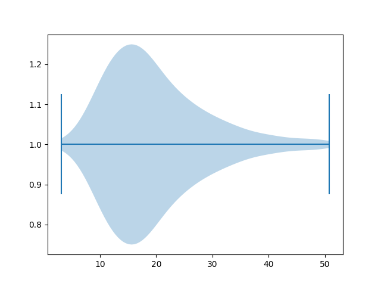
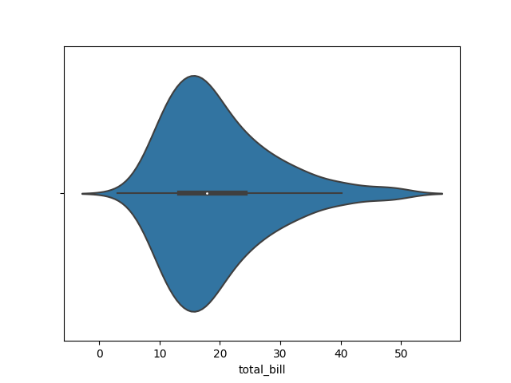
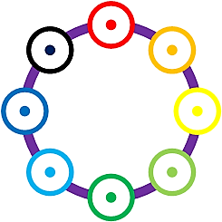

# seaborn
A collection of demo programs from *public domain* illustrating elementary Seaborn plots.
The key pre-requisite for Seaborn is the installation of matplotlib package.

1. Hello Matlibplot
Classic "Hello" example for matplotlib

2. Hello Seaborn
A very simple introduction to Seaborn using an intrinsic dataset

3.
4.
5.
6.
7.
8.
9.
10.
11.
12.
13.
14.
15.
16.
17.
18.
19.
20.
21.
22.
23.
24.
25.
26.
27.
28.
29.
30.
31.

# References
* P
* Q

